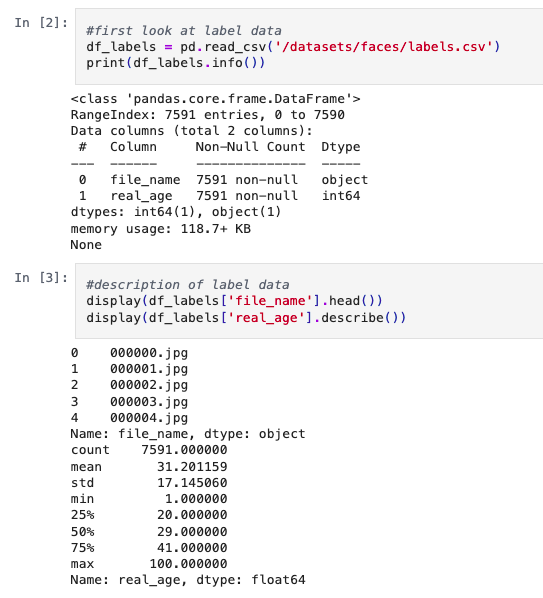
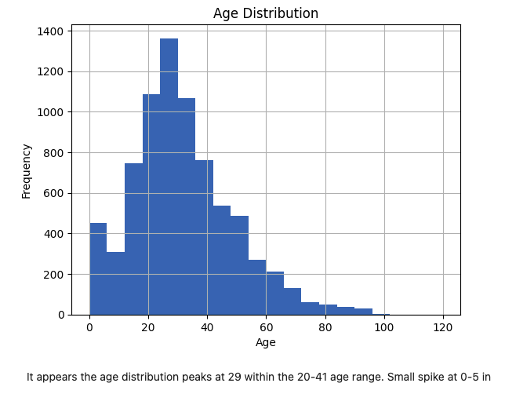
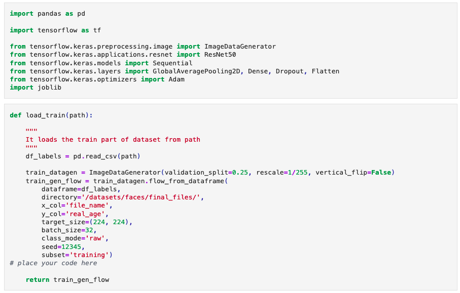
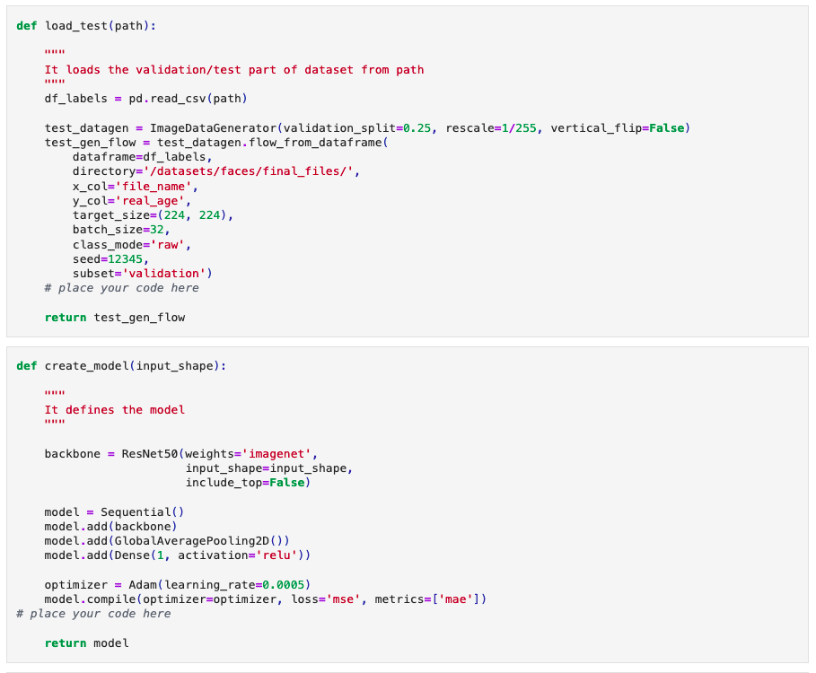
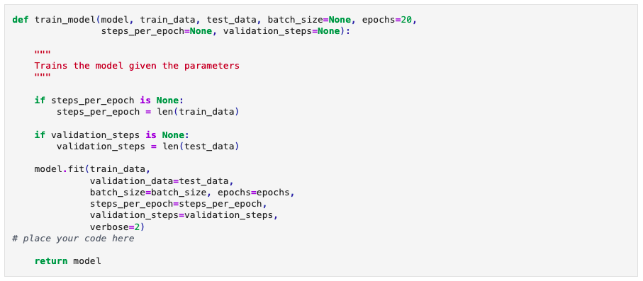
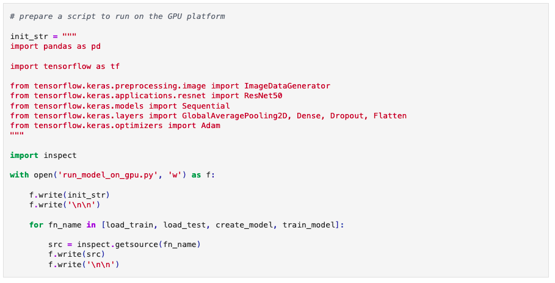

Good Seed has requested help in creating a model to verify ages of customers buying alcohol. They have provided data with image-label pairs to train the model. Perfromed EDA to identify age distributions and outliers, then training the model using the ResNet50 framework.

This project utilized the Tensorflow library to create a model capable of verifying the age of a customer purchasing alcohol.  Given the provided image-label pairs, and relevant age data, EDA revealed the age distribution of provided image-label pairs peaked 29 within the total range of 4-100, with the relevant distribution being 20-41.  Focusing on that group allowed for intentional training of the model, keeping processing time to a minimum and accuracy high.

Defined functions for loading and training the model, and created a script to be run on a GPU platform.  Used Mean Absolute Value as scoring metric.  Epoch 17/20 yielded the best results: 3.2205 MAE on training, 6.6419 on test set.  

This model appears to work for all age groups. If partnered with a human associate to verify customer age, the risks of the model incorrectly labeling an age-image pair will be mitigated. A reasonable limit would have to be encoded to ensure customers below the median age (29) and that exhibit features most closely correlating to age-image pairs below the median age are not immediately waived.

See Computer Vision project [here](https://github.com/asherchristoph/Data_projects_TripleTen/blob/main/ComputerVisionProject.ipynb).
