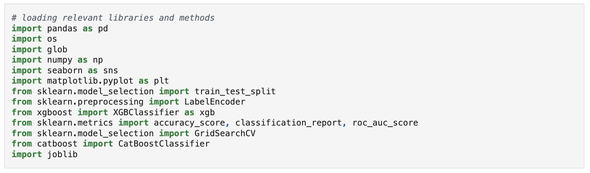
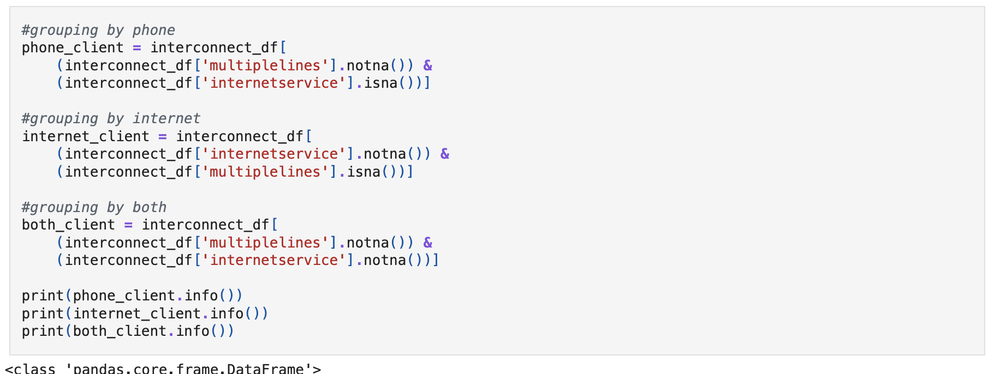
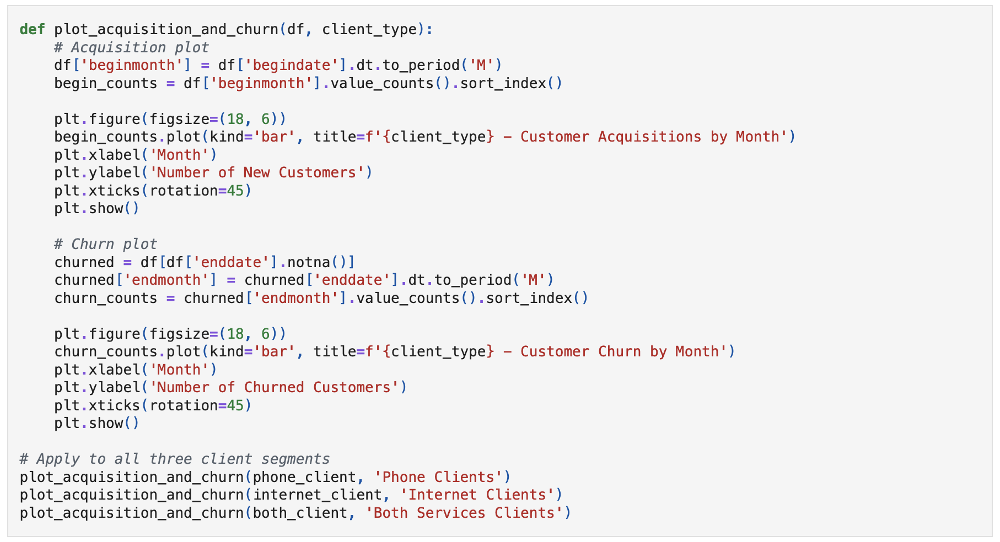
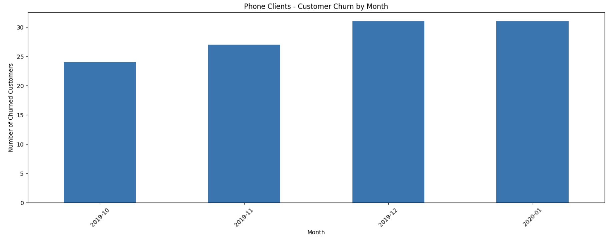
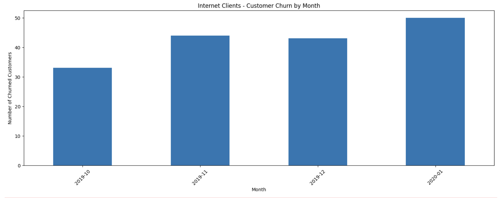
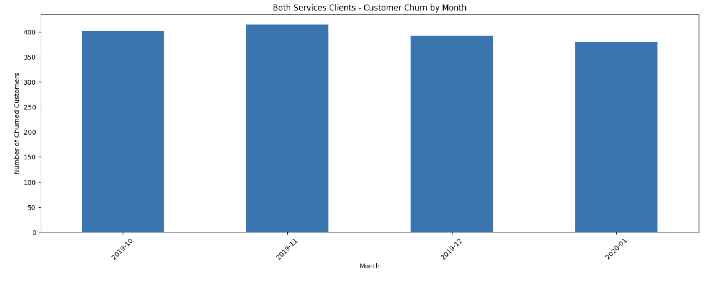
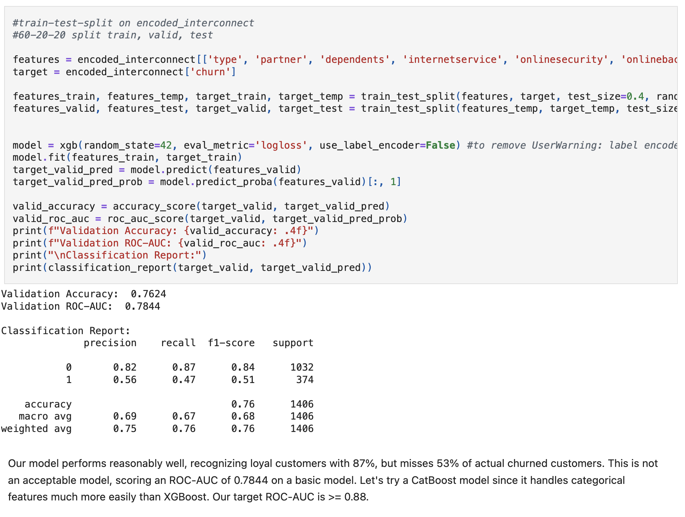
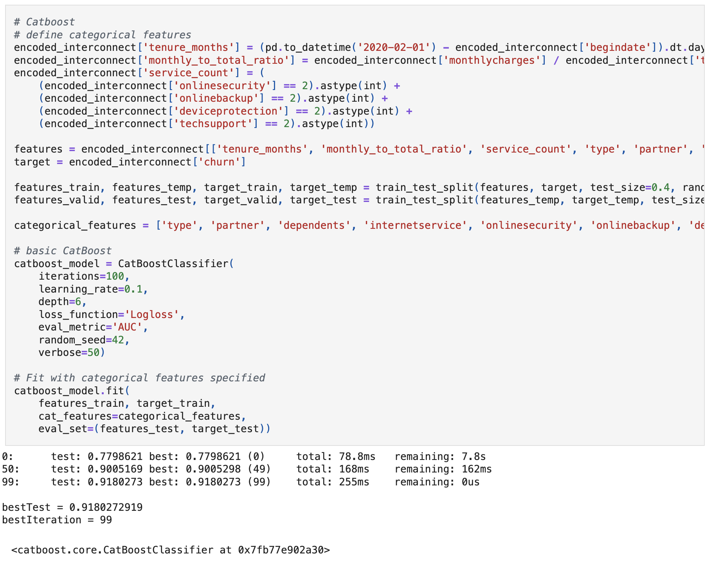
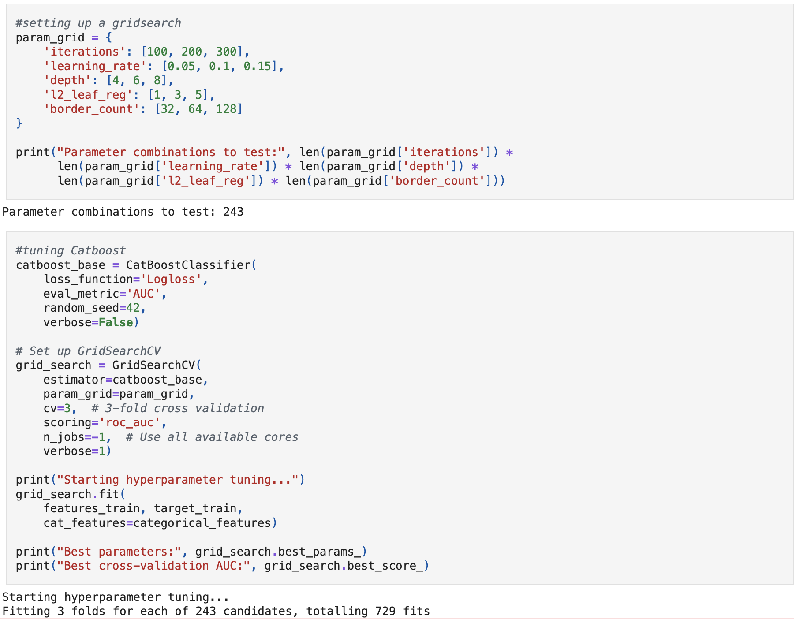
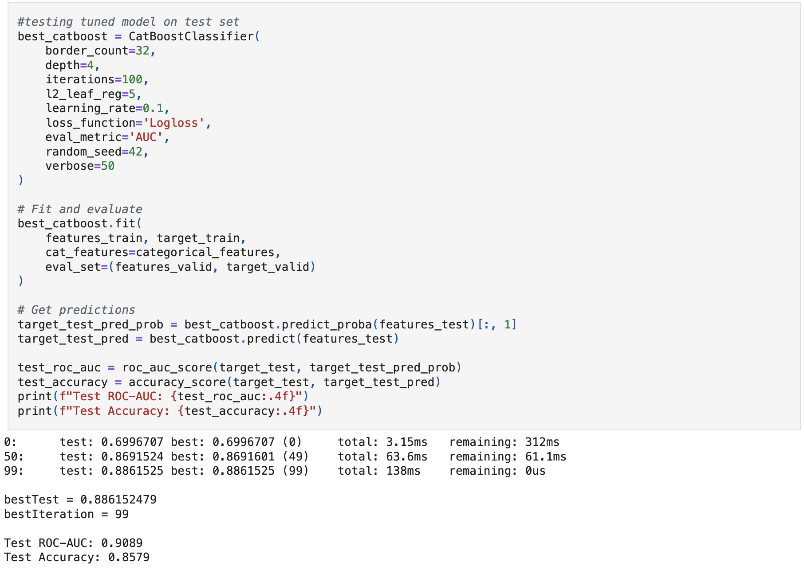

Telecom operator needs to forecast client churn. Identified churn-clients will be offered promotional codes and other special plan options. Interconnect's marketing team has sent over clients' personal data, as well as plan and contract data. AFter cleaning the data and identifying relevant features, we will create the model, testing both XGBoost and CatBoost, in an effort to achieve a ROC-AUC score >= 0.88. Overfitting is more permissable than underfitting, because we want to capture as many potential churn clients as possible.

Exploratory data analysis led to identifying relevant features as well as solving discrepancies between client IDs and phone-only, internet-only and multiservice plans.  All three groups showed heavy relative churn in the last 4 months of the 2019.  Identified the churn heavy features as month-to-month contractees, not senior citizens, single contractees with no dependents, using fiber optic internet service, and opting out of the following services: online security, online backup, device protection, and tech support.

For more charts, see the [project](https://github.com/asherchristoph/Data_projects_TripleTen/blob/main/FinalProject_Interconnect.ipynb)

With the features identified, model selection and training was next.  Tried testing XGBoost but it failed scoring.

Moved on to CatBoost because of its stengths in handling categorical features.

The CatBoost model proved to be the best model for this task since the data was largely label based, and was able to achieve a ROC-AUC score of 0.9089, surpassing the 0.88 threshold for academic full marks.  Preserving the class imbalance was crucial to correctly training the model.  The ROC-AUC metric shows this model can distinguish between churned and loyal customers almost 91% of the time.  Prioritizing ROC-AUC over Accuracy helps mitigate the loss of missing a churning customer, since misidentifying a loyal customer is a neglible cost.

See Final Project - Interconnect [here](https://github.com/asherchristoph/Data_projects_TripleTen/blob/main/FinalProject_Interconnect.ipynb).
