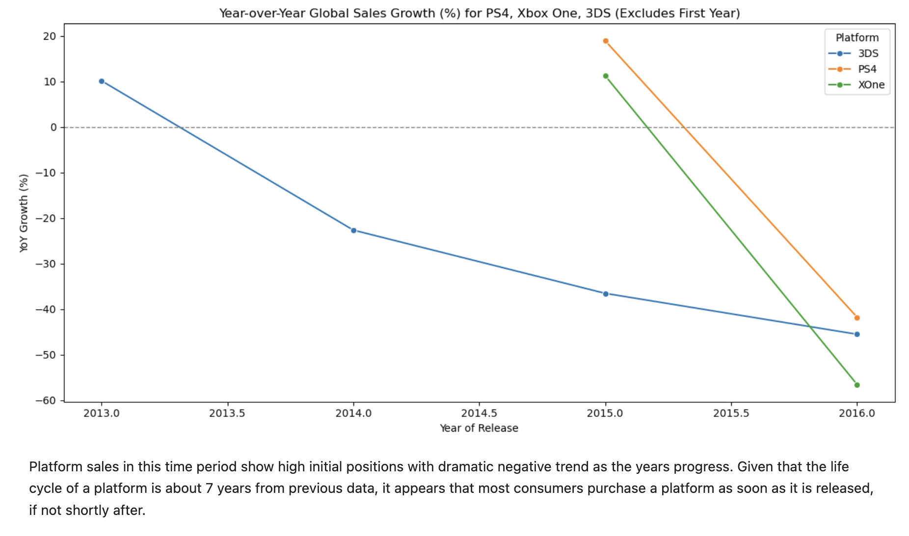
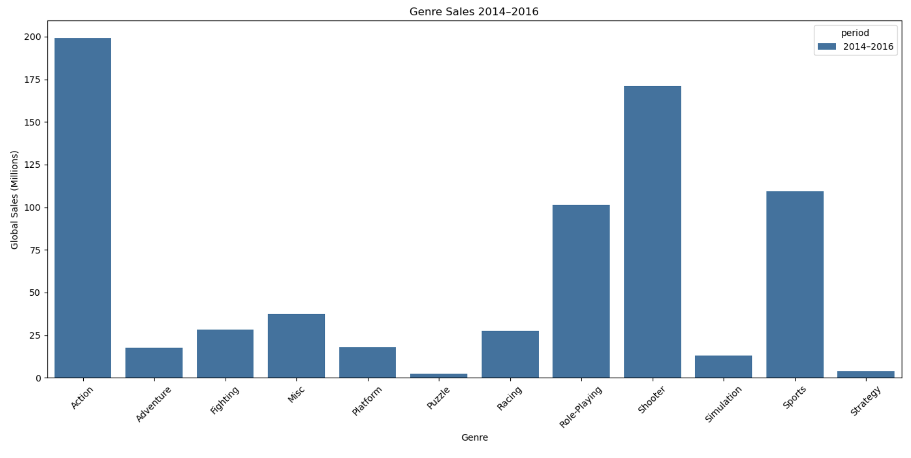
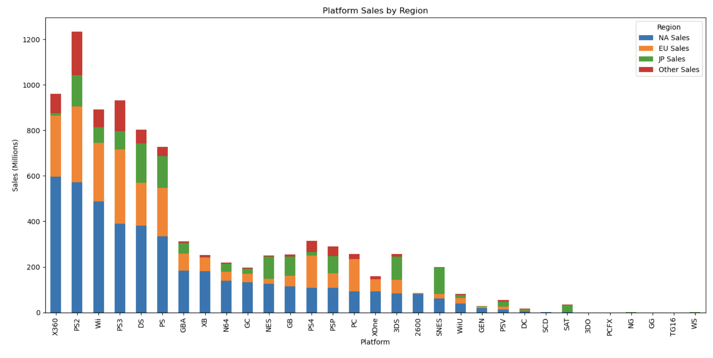
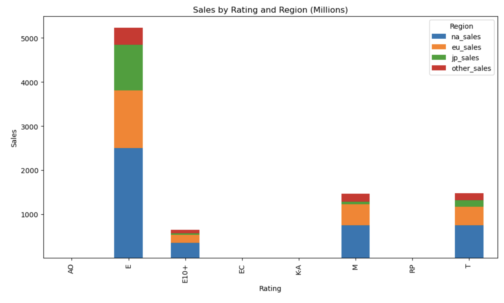
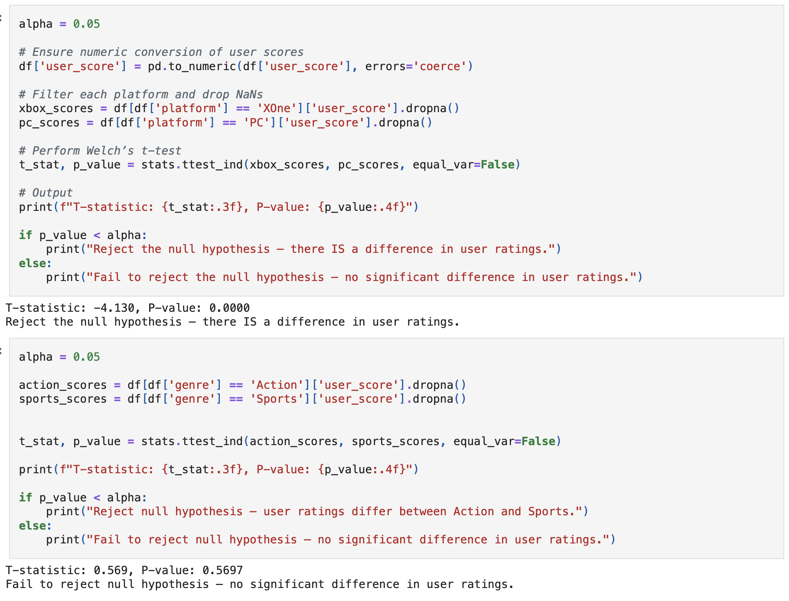

Online video game and console retailer, Ice, needed sales data analyzed to inform future advertising campaigns.  This project was pure business and statistical analysis, and no model was requested.  

After cleaning the data, and filling missing values, EDA revealed that 2008 and 2009 were the most productive release years for games, trending down after 2010.  Since 2017 is the target forecast year, the data suggest the negative trend will continue.  

PC game sales remained stable from 1994 to 2016, while selling fewer numbers, suggesting a strong player base, unaffected by console wars.  The PS4 and XboxOne game sales perform well across their resepective generations, each generation lasting about 7 years.  Playstation 4 was by far the most popular platform followed by XboxOne.  Top selling game genres were (in order) action, sports, and shooter.  The same top three selling genres also contained the highest number of releases.  

Regional market analysis revealed that North America dominates the gaming market, followed by the European Union.  North America favors Playstation 4 and XboxOne far above PC, while the EU tends to favor PC in relative equity with consoles.  Japan favors role-playing games while North America favors shooters, and the EU favors racing games.  

The vast majority of games sold across regions were rated E, followed by equal numbers of T and M rated games.

An independent two-sample t-test was used to compare if average user ratings for XboxOne and PC platforms were the same, and if average user ratings of Action and Sports genres were different.  Null hypothesis assumes no change, and alternative hypothesis assumes change.  Alpha was set at value 0.05 to control Type 1 error (false positive).  The first test regarding console ratings rejected the null hypothesis, indicating there is significant difference in user ratigs for consoles.  The second test regarding genre ratings failed to reject the null hypothesis, indicating there was no significant difference between user ratings for genres action and sports.

Across 40 years of game releases, Playstation games dominate the market across regions and the most recent years (2014-2016). The most popular genres were action and shooter games. The North American market represents the greatest market share of consumers, therefore the most profitable combination of factors for 2017 include a Playstation 4 action/shooter game released in North America.

See Integrated Project 1 [here](https://github.com/asherchristoph/Data_projects_TripleTen/blob/main/IntegratedProject1.ipynb).
